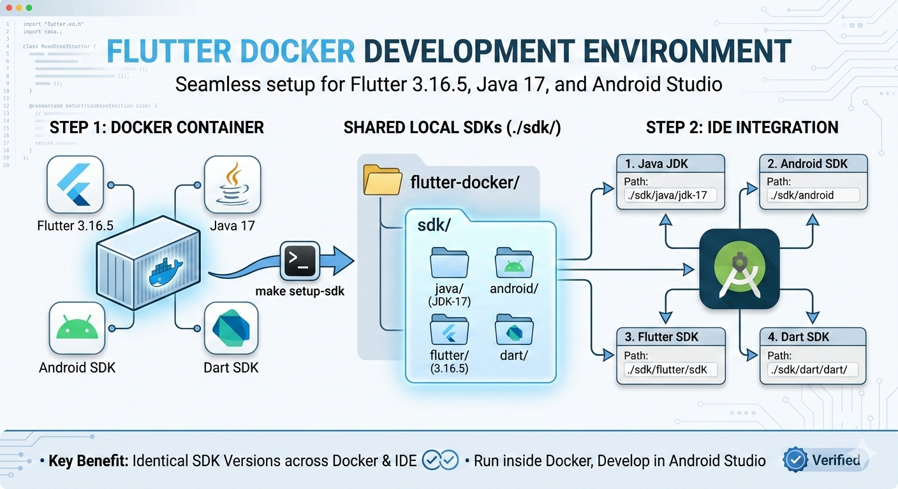

# Flutter Docker Environment for Android Studio

<div align="center">
  
</div>

Use `flutter` and `dart` from your terminal and Android Studio as if they were installed on your
machine, **without installing Flutter, Dart, Java or the Android SDK** and **without `sudo`**. Every
command runs inside a Docker container, and Android Studio uses the same SDKs as the container.

| Tool | Version |
|---|---|
| Flutter | 3.16.5 |
| Dart | 3.2.3 (bundled with Flutter) |
| Java | OpenJDK 17 |
| Android SDK | platform 34, build-tools 34.0.0, cmdline-tools latest |
| Base image | Ubuntu 22.04 |



---

## Contents

- [How it works](#how-it-works)
- [Setup from scratch](#setup-from-scratch)
- [flutter and dart in the terminal](#flutter-and-dart-in-the-terminal)
- [Daily usage](#daily-usage)
- [Zebra MC330M emulator](#zebra-mc330m-emulator)
- [Physical device behind the VPN (make tether)](#physical-device-behind-the-vpn-make-tether)
- [Maintenance](#maintenance)
- [Reference](#reference)
- [Troubleshooting](#troubleshooting)

---

## How it works

```
 Host (your laptop)                               Container: flutter-android-dev
 ───────────────────────────────────              ─────────────────────────────────────
 Android Studio                                   flutter / dart / gradle / java 17
   │ Flutter SDK = <repo>/sdk/flutter                       ▲
   │                                                        │
   └─► sdk/flutter/bin/flutter (wrapper) ── docker exec ────┘
 Terminal: flutter / dart ──────────────────────────────────┘ (in the current directory)

 <workspace>       ◄──────── same absolute path ────────►  <workspace>   (your projects)
 <repo>/sdk        ◄──────── same absolute path ────────►  <repo>/sdk
 ~/.pub-cache      ◄──────── same absolute path ────────►  ~/.pub-cache
```

1. `make setup-sdk` copies Java 17, the Android SDK and Flutter from the image into `./sdk`.
2. `sdk/flutter/bin/flutter` and `sdk/flutter/bin/dart` are replaced by small wrappers:
   - **on the host** they run the command in the container with `docker exec`, in the current
     directory (starting the container if it is stopped);
   - **inside the container** (e.g. Gradle calling `flutter.sdk/bin/flutter`) they run the real SDK.
3. The container mounts the workspace (the folder containing your projects, by default the parent
   of this repo), `./sdk` and `~/.pub-cache` **at the same absolute paths as on the host**. Files that Flutter writes inside the container (`android/local.properties`,
   `.dart_tool/package_config.json`) are therefore also valid for Android Studio on the host.
4. Android Studio's Dart analyzer, Gradle sync and JDK use the real binaries in `./sdk`; running,
   building and `pub get` go through the container.

---

## Setup from scratch

### 0. Requirements

- Docker, with your user in the `docker` group (`docker ps` works without `sudo`)
- Android Studio with the **Flutter** and **Dart** plugins
- `git`, `make`, `python3`
- ~20 GB free disk space

### 1. Clone both repositories side by side

```bash
cd ~/workspace
git clone <flutter-docker repo> flutter-docker
git clone <your project repo> my_app
```

### 2. Point the Docker setup at your project

```bash
cd ~/workspace/flutter-docker
cp .env.example .env
```

Edit `.env` and set the absolute path of your project:

```dotenv
FLUTTER_PROJECT_PATH=/home/<you>/workspace/my_app
```

`USER`, `USER_ID`, `GROUP_ID`, `HOME_PATH`, `SDK_PATH` and `WORKSPACE_PATH` are filled in
automatically by the next step. `WORKSPACE_PATH` defaults to the parent folder of `flutter-docker`
(`~/workspace` here); `flutter` and `dart` work in any directory below it.

### 3. Build and start everything

```bash
make setup
```

This runs, in order:

| Step | Target | What it does |
|---|---|---|
| 1 | `setup-env` | detects your user / IDs and writes them to `.env` |
| 2 | `setup-sdk` | builds the image and exports Java, Android SDK and Flutter into `./sdk` |
| 3 | `setup-wrappers` | replaces `sdk/flutter/bin/flutter` and `dart` with the Docker wrappers |
| 4 | `start` | starts the `flutter-android-dev` container |
| 5 | `doctor` | runs `flutter doctor` in the container |

The first run takes a while (image build + SDK download).

### 4. Fetch packages and check the generated paths

```bash
cd ~/workspace/my_app
../flutter-docker/sdk/flutter/bin/flutter pub get
cat android/local.properties
```

Both paths must point into `flutter-docker/sdk`:

```properties
sdk.dir=/home/<you>/workspace/flutter-docker/sdk/android
flutter.sdk=/home/<you>/workspace/flutter-docker/sdk/flutter
```

### 5. Configure Android Studio

Open the project (`my_app`) and set (`<repo>` = absolute path of `flutter-docker`):

| Setting | Where | Value |
|---|---|---|
| Flutter SDK | **Settings** (Ctrl+Alt+S) → Languages & Frameworks → **Flutter** | `<repo>/sdk/flutter` |
| Android SDK | **Settings** → Languages & Frameworks → **Android SDK** → *Edit* (cancel any download) | `<repo>/sdk/android` |
| JDK | **Project Structure** (Ctrl+Alt+Shift+S) → Platform Settings → **SDKs** → **+** → *Add JDK* | `<repo>/sdk/java` |
| Project SDK | **Project Structure** → **Project** → *SDK* | the JDK added above |
| Gradle JDK | **Settings** → Build, Execution, Deployment → Build Tools → **Gradle** (if shown) | the same JDK |

> The JDK name does not matter (it cannot always be renamed): just select it as the project SDK.

Then click **Pub get** in `pubspec.yaml`, pick a device and press **Run**.

### 6. Verify

```bash
cd ~/workspace/my_app
../flutter-docker/sdk/flutter/bin/flutter build apk --debug
```

Expected: `✓ Built build/app/outputs/flutter-apk/app-debug.apk`.

---

## flutter and dart in the terminal

Add the wrappers to your `PATH` (`~/.bashrc` or `~/.zshrc`), then open a new terminal:

```bash
export PATH="$HOME/workspace/flutter-docker/sdk/flutter/bin:$PATH"
```

`flutter` and `dart` then behave as if they were installed locally:

```bash
cd ~/workspace
flutter create my_new_app       # files are created on the host, owned by you
cd my_new_app
flutter pub get
flutter run                     # interactive: r / R / q work
dart format lib
dart run bin/tool.dart
```

- Commands run in the **current directory**, which must be inside `WORKSPACE_PATH` (`~/workspace`
  by default). Elsewhere the wrapper stops with `... is not mounted in the container`; change
  `WORKSPACE_PATH` in `.env` and run `make start` to mount another folder.
- If the container is stopped, the wrapper starts it. If it does not exist yet, run `make start`.
- Exit codes, stdin/stdout and pipes work as usual; a TTY is used only when running in a terminal.
- Global tools installed with `dart pub global activate` run inside the container
  (`make access`, then call them by name).

---

## Daily usage

```bash
cd ~/workspace/flutter-docker
make start        # after a reboot: start the container (required before using Android Studio)
```

Then work normally in Android Studio. Useful targets (`make help` lists them all):

| Category | Command | Description |
|---|---|---|
| Container | `make start` / `stop` / `restart` | start (recreated to apply config changes), stop, restart |
| | `make access` | shell inside the container |
| | `make logs` | follow container logs |
| Flutter | `make doctor` | `flutter doctor` |
| | `make pub-get` / `pub-upgrade` | `flutter pub get` / `upgrade` |
| | `make run` / `test` / `clean` | `flutter run` / `test` / `clean` |
| | `make build-apk` / `build-appbundle` | Android builds (`FLUTTER_ARGS="--release"` etc.) |
| | `make flutter FLUTTER_ARGS="..."` | any Flutter command |
| Info | `make version` / `dart-version` / `java-version` / `info` | tool versions |
| Android | `make android-licenses` | accept SDK licenses |
| Emulator | `make avd` / `emulator` / `scan CODE=...` | see [below](#zebra-mc330m-emulator) |
| Device | `make tether` / `tether-stop` / `adb-wifi` | see [below](#physical-device-behind-the-vpn-make-tether) |
| Cleanup | `make clean-all` | `flutter clean` + remove container and volumes |

All Flutter targets (and `make access`) run in `FLUTTER_PROJECT_PATH`.

---

## Zebra MC330M emulator

An Android Virtual Device matching the Zebra MC330M scanner, to test the app without the device.

| Property | Value |
|---|---|
| Android | 8.1 (API 27, Google APIs, x86) |
| Screen | 4.0" WVGA, 480 × 800, 240 dpi |
| RAM | 2 GB |
| Input | touchscreen + physical keypad + d-pad |

```bash
make avd                                   # once: download emulator + image, create "Zebra_MC330M"
make emulator                              # start it
make scan CODE='123456789'                 # simulate a barcode scan
make scan CODE='{"id":"12345"}'            # simulate a JSON QR code scan
```

**How scans are simulated:** on the real device, DataWedge broadcasts each scan to the app.
`make scan` sends the same broadcast with `adb`:

- action: the intent action configured in your app's DataWedge profile, set as `SCAN_ACTION` in
  `.env` (e.g. `SCAN_ACTION=com.example.my_app.SCAN`)
- extra: `com.symbol.datawedge.data_string` = the scanned code

The current screen must be listening for scans (not the login screen). In debug builds the scanned
value is printed in the logs as `I/flutter`.

**Without hardware virtualization** (no `/dev/kvm`, VT-x disabled in the BIOS), `make emulator`
automatically starts in software mode: it works but is slow (~3 min boot). If Android shows
*"System UI isn't responding"*, tap **Wait**. Start the emulator with `make emulator` rather than from
the Android Studio Device Manager, which may refuse to start it without acceleration.

---

## Physical device behind the VPN (make tether)

When the API is only reachable through the laptop's VPN, a device on the laptop's Wi-Fi hotspot
cannot reach it: the hotspot shares the plain connection, not the VPN (fixing this needs root or the
VPN client's settings). `make tether` uses [gnirehtet](https://github.com/Genymobile/gnirehtet)
reverse tethering instead: the device's traffic goes through adb and its connections are opened by
the laptop, so they use the VPN like any local app. No root is needed, on the laptop or the device.

```bash
make tether                       # device connected over USB: Ctrl+C to stop
```

- The first run downloads gnirehtet into `sdk/gnirehtet` (checksum verified) and installs its app
  on the device: accept the **VPN connection request** on the device (a key icon then appears in
  the status bar).
- The device uses the laptop's current DNS server (the VPN one, so internal host names resolve).
  Override it with `make tether TETHER_DNS=<ip>`.
- With several devices connected, pick one with `DEVICE=<serial>` (see `adb devices`).
- `make tether-stop` stops it on the device if `make tether` was not stopped cleanly.

**Without a cable** (device on the laptop's hotspot), use adb over Wi-Fi:

```bash
make adb-wifi                     # device on USB and on the hotspot: switches adb to Wi-Fi
# unplug the device
make tether DEVICE=<device-ip>:5555
```

The hotspot then only carries adb; the API traffic goes through the laptop and the VPN.

If the VPN request never appears on the device, its device management (MDM) probably blocks VPN apps.

---

## Maintenance

### Switch to another project

```bash
# .env: FLUTTER_PROJECT_PATH=/home/<you>/workspace/<other-project>
make start
```

The wrappers do not depend on the project: `flutter` and `dart` already work in any project inside
`WORKSPACE_PATH`. `FLUTTER_PROJECT_PATH` is only the directory used by the `make` targets.

### Re-export the SDKs (e.g. corrupted `./sdk`)

```bash
make setup-sdk setup-wrappers start
```

`setup-sdk` deletes and re-creates `sdk/java`, `sdk/android`, `sdk/flutter` and `sdk/dart`
(the emulator and system images must then be reinstalled with `make avd`).

### Upgrade Flutter

1. Change `ENV FLUTTER_VERSION=3.16.5` in the `Dockerfile`.
2. Run `make setup-sdk setup-wrappers start`.
3. Check the `.fvmrc` / `environment.sdk` constraints of your project.

---

## Reference

### Project structure

```
flutter-docker/
├── Dockerfile              # image: Ubuntu 22.04 + Java 17 + Android SDK + Flutter
├── docker-compose.yml      # container: mounts, environment, host network
├── Makefile                # all commands (make help)
├── .env.example            # template for .env (git-ignored)
├── scripts/
│   ├── create-avd.sh       # creates the Zebra MC330M AVD (used by make avd)
│   └── sdk-wrapper.sh      # flutter/dart wrapper (installed by make setup-wrappers)
├── sdk/                    # git-ignored, created by make setup-sdk
│   ├── java/               # JDK 17
│   ├── android/            # Android SDK (+ emulator / system images after make avd)
│   ├── flutter/            # Flutter SDK (bin/flutter and bin/dart are wrappers)
│   ├── dart/               # standalone copy of the Dart SDK
│   └── gnirehtet/          # reverse tethering relay (downloaded by make tether)
└── README.md
```

### `.env` variables

| Variable | Set by | Description |
|---|---|---|
| `FLUTTER_PROJECT_PATH` | **you** | absolute path of the Flutter project used by the `make` targets |
| `WORKSPACE_PATH` | `make setup-env` (if empty) | folder mounted at the same path in the container; `flutter` / `dart` work below it (default: parent of this repo) |
| `SCAN_ACTION` | **you** (optional) | DataWedge intent action of your app, used by `make scan` |
| `TETHER_DNS` | **you** (optional) | DNS server used by the device with `make tether` (default: the laptop's current DNS) |
| `USER`, `USER_ID`, `GROUP_ID` | `make setup-env` | host user, so files created in the container belong to you |
| `HOME_PATH` | `make setup-env` | host home directory (`~/.pub-cache` is shared from there) |
| `SDK_PATH` | `make setup-env` | absolute path of `./sdk`, mounted at the same path in the container |

### Container environment

| Variable | Value |
|---|---|
| `JAVA_HOME` | `/usr/lib/jvm/java-17-openjdk-amd64` |
| `ANDROID_HOME`, `ANDROID_SDK_ROOT` | `${SDK_PATH}/android` |
| `FLUTTER_HOME` | `${SDK_PATH}/flutter` |
| `DART_HOME` | `${SDK_PATH}/flutter/bin/cache/dart-sdk` |
| `PUB_CACHE` | `${HOME_PATH}/.pub-cache` (host directory) |

The container uses the host network, so `adb` in the container and on the host share the same
devices (USB devices and emulators).

---

## Troubleshooting

| Symptom | Cause / fix |
|---|---|
| `local.properties` contains `/opt/flutter` or `/workspace/sdk` | container created from an old `docker-compose.yml`: `make start`, then `flutter pub get` |
| Gradle sync: `Error loading java.security file` | `sdk/java` exported by an old Makefile (links into the container's `/etc`): `make setup-sdk` |
| Gradle: `assert pluginDirectory.exists()` under `~/.pub-cache` | container not using the host pub cache: `make start`, then `flutter pub get` |
| Build: `.../sdk/flutter/bin/flutter` finished with exit value 127 | old wrappers that only work on the host: `make setup-wrappers` |
| `flutter: container flutter-android-dev does not exist` | `make start` |
| `flutter: ... is not mounted in the container` | run it inside `WORKSPACE_PATH`, or change `WORKSPACE_PATH` in `.env` and `make start` |
| `flutter` still runs in the wrong directory / no colors | old wrappers: `make setup-wrappers` |
| `~/.pub-cache` owned by root | created by Docker before it existed: remove it, then `make start` |
| Android Studio: project SDK `17` not found | add `sdk/java` as a JDK and select it in **Project Structure → Project** |
| `flutter doctor`: unknown channel / upstream warnings | expected (SDK copied from the image), harmless |
| Emulator very slow / "System UI isn't responding" | no `/dev/kvm`: software mode, tap **Wait** |
| Android licenses not accepted | `make android-licenses` |
| Device on the hotspot cannot reach the API (VPN) | use `make tether` instead of the hotspot's routing |
| `make tether` waits forever | no device in `adb devices`: plug it in, or `make adb-wifi` / `adb connect <ip>:5555` |
| `make tether`: API host names do not resolve | wrong DNS: `make tether TETHER_DNS=<VPN DNS server>` (`resolvectl status`) |
